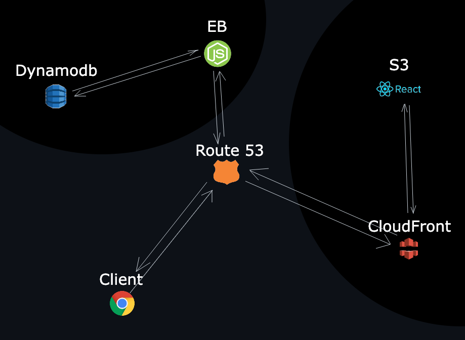

<br /><br />

# 🙋🏻‍♂️ Former antonioguiotto.com ↗️

<br /><br />

# 💡 **WHAT IS THIS ABOUT?**

This is an application to keep my works updated and available to the public.<br />
In this application you can find my portfolio and download it.<br />
Other services might be available at this time.<br />

<br><br>

# 👁 **OVERVIEW**
## **AWS Architecture**



## **Tech Stack & Third Parties**

- **`React`** : React with Typescript

- **`Express`** : Express.js

- **`SSL & JWT`** : this application is secured by using the HTTPS protocol and JWTs for authentication.

- **`Amazon Web Services`** : Route53, s3, CloudFront, Elastic Beanstalk, Dynamodb, IAM

- **`Google Cloud`** : Google SDK for nodemailer 

<br><br>

# ⚡️ **GET STARTED**

### **SCRIPTS**

- go to `./server` and run `npm run start:dev` to spin up localhost server
- go to `./client` and run `npm start`
- go to `./client` and run `npm run sass:watch`

> ⚠️ If you're using OSX and Terminal, you can try this shell script from root:

> ⚠️ You will need to modify the path inside the file to fit your!

- `./osx-start-dev.sh`

### **ABOUT THE CODE**

The front-end application is inside of ./client folder, here we ll find a React application used with Typescript.

Inside of ./server we - as you can imagine - find the server which is an express application.

<br><br>


# 🙋🏻‍♂️ **DEPLOYMENT 🚀 CLIENT APP**

> Application: **React Typescript**

> Folder name: **client**

<br>

For more information on the available scripts, refer to *./client/README.md*

<br>

## **AWS > S3**

- `FE-1.1` - create two s3 buckets named www.antonioguiotto.com, and antonioguiotto.com

- `FE-1.2` - we will work only inside `www.antonioguiotto.com` untill I say otherwise

- `FE-1.3` - copy each file and folder of the React `build` inside of the www bucket

- `FE-1.4` - Ensure you make it public by selecting the content then `Actions > Make public`

- `FE-1.5` - In the `Permissions` tab, deactivate `Block public access` checkboxes

- `FE-1.6` - In `Properties` tab, under `Static website hosting`, enable it.

- `FE-1.7` - index document will be `index.html` or whatever you re using

> ⚠️ Notice that hosting type, we will use this bucket (www.antonioguiotto.com) as static website, and the other (antonioguiotto.com) to redirect to this one

- `FE-1.8` - let's go now inside bucket antonioguiotto.com

- `FE-1.9` - In `Properties` tab, under `Static website hosting`, enable it.

- `FE-1.10` - Here we need to set `redirect request for an object`

- `FE-1.11` - Host name target will be the other bucket `www.antonioguiotto.com`

- `FE-1.12` - Set it to HTTPS

- `FE-1.13` - Should look like this:
## **AWS > Route 53**

- `FE-2.1` - Buy a domain `antonioguiotto.com`

- `FE-2.2` - Create a hosted zone `antonioguiotto.com`

- `FE-2.3` - If you have this problem:

  - `FE-2.3.1` - Copy the NS from Route53 hosted zone

  - `FE-2.3.2` - Go to `Route53 > Domains > Registered domains`

  - `FE-2.3.3` - click on your domain and then click on link `Add or edit name servers`

  <br>

- `FE-2.4` - Let's now create two records in out hosted zone, one with www and one without

- `FE-2.5` - Go to `create record`, then `wizard` then `simple routing`

- `FE-2.6` - Click create record afterwards

> At this point we should have a working unsecure (HTTP) website, let's continue to add a SSL certificate to our domain

## **AWS > Certificate Manager**

- `FE-3.1` - Go to certificate manager

- `FE-3.2` - Create a certificate and target:
  - www.antonioguiotto.com
  - antonioguiotto.com

- `FE-3.3` - If you have issue with pending validation: go back to `FE-2.3`

## **AWS > CloudFront**

- `FE-4.1` - Open cloudFront and s3

- `FE-4.2` - We are about to create two distributions, one for s3 www.antonioguiotto.com and another for the s3 antonioguiotto.com

- `FE-4.3` - Starting with the www

- `FE-4.4` - on cloudFront click `Create distribution`, in the first field origin domain, we need to insert the s3 Bucket website endpoint found under `Properties` tab, looks like this http://www.antonioguiotto.com.s3-website-us-east-1.amazonaws.com.

- `FE-4.5` - Now we need to set HTTP request to HTTPS

- `FE-4.6` - In `Alternate domain name`, we set:
  - www.antonioguiotto.com

- `FE-4.7` - Select SSL certificate

- `FE-4.8` - Now you should be able to see the website from cloudFront of the www bucket

- `FE-4.9` - Now we need to redirect our domain to cloudFront instead of s3

- `FE-4.10` - Go to `Route53 > hosted zones` to your hosted zone and see that antonioguiotto.com and www.antonioguiotto.com is targetting s3 resources.

- `FE-4.11` - Select each of the mentioned records and edit them to target the cloudFront distribution

<br><br>

# 👮🏻‍♂️ **DEPLOYMENT 🚀 API SERVER (Back-end)**

> Application: Express

## AWS > Route53

- `BE-1.1` - [OPTIONAL] get new domain and create new hosted zone `api.guiotto.link`

- `BE-1.2` - add a SSL Certificate to the domain `api.guiotto.link`

- `BE-1.3` - create an environment with elastic beanstalk, then create an application 

- `BE-1.4` - go in the `Configuration` section and edit `Load balancer`, we need to add a new listener which will listen port 443, with HTTPS method and our new certificate

- `BE-1.5` - Deployment Troubleshooting
    
  - I tried to delete the Application versions

  - I tried to delete the Application

  - I tried to delete related files on S3
  
  - I tried to `Heath > Reboot`

  - I tried to `rebuild enironment`

  - I tried to add this policy to my user, as it was mentioned in a AWS banner:

      "*In September 2020, Elastic Beanstalk introduced the EnhancedHealthAuthEnabled option. It enables you to require authorization of instances that report enhanced health information. If you're using an Elastic Beanstalk managed policy for your environment's instance profile (the default when using Elastic Beanstalk console or EB CLI), you can safely enable this option.*"

      "*On September, 2021, we are enabling this option by default for all new environments(no impact on existing environments)*"

      "*If you are using a custom instance profile instead of a managed policy, your environment might show the No Data health status. This happens because the instances aren't authorized for the action that communicates enhanced health data to the service. To authorize the action, add permission to your instance profile according to Enhanced health authorization  in the Amazon Elastic Beanstalk Developer Guide.*"
        
      ```json
      {
        "Version": "2012-10-17",
        "Statement": [
          {
            "Sid": "ElasticBeanstalkHealthAccess",
            "Action": ["elasticbeanstalk:PutInstanceStatistics"],
            "Effect": "Allow",
            "Resource": [
              "arn:aws:elasticbeanstalk:*:*:application/*",
              "arn:aws:elasticbeanstalk:*:*:environment/*"
            ]
          }
        ]
      }
      ```

<br><br>

# 🗄 **DATABASE**

> Application: Dynamodb
## Create a Dynamodb Table

- `DB-1.1` - in this case we just need to create a table


<br>
<br>
<hr>

# 🙋🏻‍♂️ This website is available at antonioguiotto.com ↗️

> Credits: Antonio Guiotto - powerhydratoni@gmail.com
